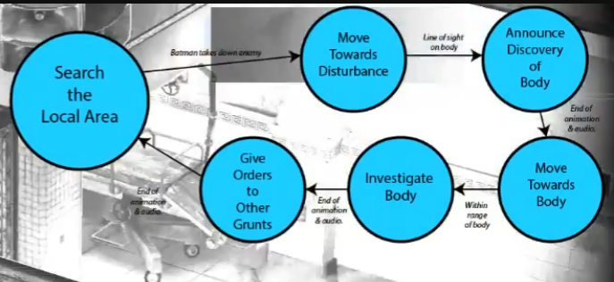
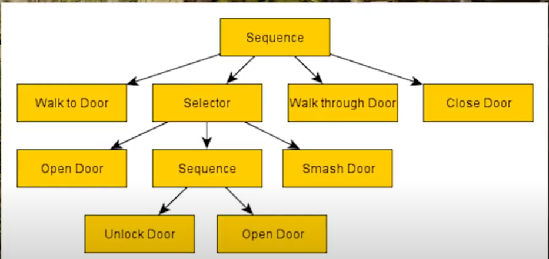
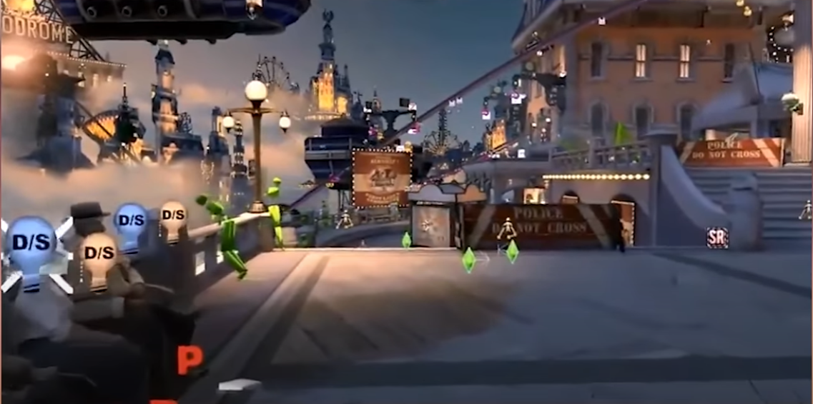

# AI in Different Games

##  0. General Intelligence in Games

AI is not good at it. AI is good at solving problems for specific domains.

## 1. F.E.A.R. - Goal Oriented Action Planning

## 2. Arkham Asylum - FSM

## 3. Pac-man

## 4. L4D - Director of AI

Manages the flow of gameplay, like intensity.

Manipulates the curretn state of the gmae world and an effort to keep players under duress

- The build-up
- The peak
- The relax

Stress levels increase by:
- Zombies attacking players (gradual)

- Attacks within proximity(gradual)

- Special attacking players (instant)

## 5. HALO2 - Behaviour Tree

Think in context

Priority in context (some times if in vehicle, enemy will not hide, instead it attacks and sometimes get closer)

## 6. Battlefield 3 - Performance Modelling

e.g., drivatar in Forza, director of L4D

Psy-Ops, Anylize player

The Big Five:
- Openness
- Conscientiousness
- Extroversion
- Agreeableness
- Neuroticism

## 7. Transformers: Fall of Cybertron - HTN Planning

Focus on abstract behaviour by structuring actions together

## 8. Alien: Isolation - 100-Node BTs, Micro AIs

Scarier when closer but 

- Two Tier System 

    - Director: Managers the scene and keeps tabs on the current status of both the player and the Alien

    - The Alien AI: A reactive sense-driven NPC that reacts both to player actions and commands from the director

- Job System
    
    Dictates to Alien AI

    - What tasks to execute
    - The locations to conduct these tasks
    - The priority of each task

- Two Main Alien AI States

    - Active / Front State

        Conduct a search in th local area of the player or an event

    - Passive / Back State

        Alien climbs up into the air vents or directed to other areas of the station

- BTs

    - 30 nodes wide (Top decision layer)
        
        Sub-trees dedicated to specific tasks (attacking, searching, etc.)

    - Learn-rate can vary

        In the event the player has not caused specific sub-trees to unlock by their own action, the system will unlock them as specific checkpoints

- "Sensor" system

    - Variety of path-findin-driven sensors
        
        Alien can detect a variety of noises from footsteps to gunshots and the motion tracker. Range of each sensor depends on the type of noise being made

    - Pathifinding location types

        Search: Moves towards that location

        Spot: Stays wherre it's a standing and looks towards it

        Designers can dictate areas it cannot visit

- Searching System

    - Sub-optimal Exploration of all Nav Points: Alien searches all prescribed locations but in any given sequence, sometimes resulting in the alien backtracking to areas it visited before

## 9. Far Cry - The Systemic AI 

- Enemy
- Ally
- Civilian
- Wildlife

1. NPCs only exist within 500m of the player at all times

2. FSM that respond to local stimuli

3. Limited number of NPCs can be in-game at once and AI will add/remove accordingly.

## 10. Team Fortress 2 - Status Performance

## 11. BioShock Infinite - Liz 

- "Goal-Side": A football defensive tactic where defending players ensure they are standing between the goal and the opposing player who ahas possession of the ball

- "Smart Terrain": Items that could be found sitting somewhere on the game-worlds nav mesh taht'll trigger specific animation and audio cues for non-player characters

- "Emotional State"

- "Nav Mesh": Aiming to stop Liz from walking into areas where enemies are standing

- "Booker-Catch": Throw useful objects to the player