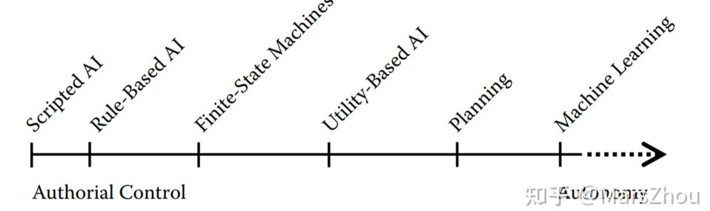
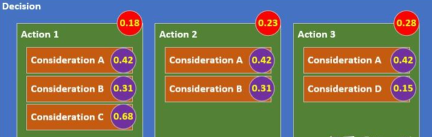
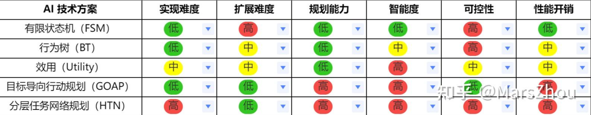

# 游戏AI

本文所讲为上篇中的狭义AI范畴

## 架构

### 概述

游戏 AI 的架构是指为实现游戏中智能行为而设计的整体系统结构。一个良好的游戏 AI 架构需要具备高效性、可扩展性和灵活性等，以便处理各种复杂的游戏场景和交互。

典型的游戏 AI 架构一般包括如下模块（或者叫组件或系统）：感知、决策、行为、动作。其中动作和行为也有合并到一起的，但这里分开为2套，原因下面再说。也有更多组件模块的，如基于强化学习的 AI 架构还包括学习和适应组件等，但本文还是尽量关注在较为典型的游戏架构上。

### 感知

感知模块负责收集游戏世界的信息，并将这些信息传递给 AI 代理。

从技术角度来说，感知模块为其他模块提供数据，数据哪里来？从游戏世界里获取。

感知模块获取数据的方式一般有两种：“说人话”：思考和反馈（这是真的从人的角度上说的话）。用机器（程序）的话说则分别对应：拉取和推送，或者叫轮询和事件。如果读者是程序员的应该对这些概念相当熟悉。翻译为通用语则分别对应：AI 主动从游戏世界获取数据；游戏世界主动给 AI 推送数据。

感知模块的实现上，很多方案都是主要借助黑板（Blackboard，BB，行为树常用）或类似的数据容器（如 GOAP 和 HTN 的 WorldState ）来做到的。

### 决策

决策模块负责根据感知到的信息做出行为选择。

这个其实才是本文想要分享的内容的重点，后面会提到，虽然我们说的是游戏 AI 技术方案或者架构，应当包含所有本段所述的模块，各模块都有其重要性，但其他模块其实有很大的通用性或复用性，唯决策模块在不同技术方案下差异或者说特色很明显，后面我们重点讨论这个。

### 行为

行为模块负责将决策模块选定的高层次行为转化为具体的行动计划。一旦决策模块选择了一个行为，行为生成模块负责执行具体的动作。这包括动画控制、路径规划和动作指令等。

可以理解为从“要做什么”到“如何做”的桥梁。

### 动作

动作模块负责具体执行和管理由行为生成模块指派的低层次动作，包括移动、攻击、互动等。

这一层是直接与游戏引擎的物理和动画系统交互的部分。你也可以直接理解为就是对各种引擎底层API的调用吧，比如调用动画播放接口，调用移动接口啥的。

以上也可以看出，动作和行为两个模块的差异，他们在抽象层次、职责范围和交互对象等方面都是不一样的。

不过相当多文章把行为和动作两个模块统一为一个的，这个从某些角度来说也是可以的，但本文想把他们分开，这样一定程度上更有利于实际开发时的功能解耦和复用。


## 方案

典型的游戏 AI 架构方案有 FSM、BT、Utility、GOAP、HTN 等，这是本文的重点，他们的概念、原理、示例代码、优劣、适用场合和应用示意等后面详述。

不同的 AI 方案在可控性、AI 自治性（结果的可预测性）、可扩展性、实现的复杂度、是否可规划、性能开销等方面是不一样的，具体会在下文各方案的具体段落细说，文末总结部分也会以表格形式展示出来。可以先看看《Game AI Pro》对各方案的可控性和自治性的展示，有个大概的印象即可：




一，GOAP 和 HTN 等均属于 Planning；

二，Utility AI 本身其实也有多种级别，简单的可能比 Planning 更好控制，复杂的则可能比 Planning 更有自治性。

三，自治性或者说 AI 的行为是否难以被预测性、AI 是否难以被掌控，这个并非绝对的是利或者是弊，不同的游戏或需求对这个的要求是不一样的，要辨证去看。

可以在后面的段落中对对应的 AI 方案做了说明有了足够的理解后再来验证这点。

其实也可以叫做 AI 技术架构，但是叫 AI 技术方案更亲民一点，总之本段要说的是本文的核心：游戏 AI 的各种行为决策方案（但这些方案也是包括游戏 AI 的其他模块的，比如感知和行为等）。

### FSM

#### 概念

有限状态机（Finite-State Machine，FSM）又称有限状态自动机（Finite-State Automaton，FSA），简称状态机，是表示有限个状态以及在这些状态之间的转移和动作等行为的数学计算模型，在游戏 AI 中也是一种简单但功能强大的 AI 架构，适用于管理 AI 代理的不同状态及其转换。例如，一个 NPC 可以处于“巡逻”、“追逐”或“攻击”状态，在不同状态之间根据特定条件进行转换。

这东西可能大部分读者都很熟悉，即便是还没工作的学生，也对此有所了解，同时在某些游戏项目或引擎下，FSM 的使用也很常见。

状态（State）（加上各种方案的英文有其必要性，因为这对于理解相关英文的论文、文档以及阅读和编写相关的代码都有帮助）：每个状态表示 AI 的一种特定行为或动作。

转换（Transition）：状态之间的有向边，表示从一个状态到另一个状态的转换条件。

输入（Input）：触发状态转换的条件或事件，例如玩家的位置、时间等。

初始状态（Initial State）：AI 的初始状态，表示开始时的行为。

#### 流程

定义状态：列出所有可能的状态，例如“巡逻”、“追踪”、“攻击”等。

定义转换条件：确定每个状态之间的转换条件，例如“玩家进入视野”、“玩家离开攻击范围”等。

实现状态行为：为每个状态编写具体的行为逻辑，例如在“巡逻”状态下，AI 角色会在预定路径上移动。

实现状态管理：实现状态的转换逻辑，确保在满足转换条件时，能够正确切换状态。

#### 示例

FSM 很常见，实现方式也多种多样，可以定义多个状态后通过 if else 转换，也可以用 OOP 思想封装一下各种状态（业务逻辑里常用），还可以定义为节点（就跟 UE 和 Unity 的动画状态机一样）。

这里直接展示一下《Game AI Pro 3》里的一种“可复用轻量级”实现，虽然轻量，但 FSM 的要素均具备，且状态的切换基于 Transition 实现，一定程度上耦合较低，比较推荐。

```cpp
class State
{
    GameObject *m_pOwner;

public:
    State(GameObject *pOwner)
        : m_pOwner(pOwner)
    {
    }
    virtual ~State() {}
    virtual void OnEnter() {}
    virtual void OnExit() {}
    virtual void OnUpdate(float deltaTime) {}

protected:
    GameObject *GetOwner() const { return m_pOwner; }
};

class StateMachine
{
    typedef pair<Transition *, State *> TransitionStatePair;
    typedef vector<TransitionStatePair> Transitions;
    typedef map<State *, Transitions> TransitionMap;
    TransitionMap m_transitions;
    State *m_pCurrState;

public:
    void Update(float deltaTime);
};

class Transition
{
    GameObject *m_pOwner;

public:
    Transition(GameObject *pOwner)
        : m_pOwner(pOwner)
    {
    }
    virtual bool ToTransition() const = 0;
};

class RunAnimationState : public State
{
    AnimationId m_animToRun;

public:
    RunAnimationState(GameObject *pOwner)
        : State(pOwner)
    {
    }
    // Function to load the state definition from XML, JSON,
    // or some other data system. This will fill all the
    // internal data members for this state.
    virtual bool LoadStateDef(StateDef *pStateDef) override;
    virtual void OnEnter() override
    {
        GetOwner()->RunAnimation(m_animToRun);
    }
};

void StateMachine::Update(float deltaTime)
{
    // find the set of transitions for the current state
    auto it = m_transitions.find(m_pCurrState);
    if (it != m_transitions.end())
    {
        // loop through every transition for this state
        for (TransitionStatePair &transPair : it->second)
        {
            // check for transition
            if (transPair.first->ToTransition())
            {
                SetState(transPair.second);
                break;
            }
        }
    }
    // update the current state
    if (m_pCurrState)
        m_pCurrState->Update(deltaTime);
}

```

#### 优点

简单易懂：FSM 的逻辑简单，易于实现和理解。

明确的行为分离：每个状态对应一种具体的行为，便于管理和调试。

性能高：FSM 的状态转换和行为执行通常具有较低的计算开销。这点不容忽视，其实很多看起来强大的方案（我没说你啊，GOAP），性能开销也对应的大了很多，所以到底怎么选取，还得结合具体的需求和环境了）。

#### 挑战

状态爆炸：当状态数量增多或行为复杂度增加时，FSM 的状态和转换条件会迅速增多，导致管理困难。

缺乏灵活性：FSM 的状态和转换条件是固定的，难以应对动态变化或复杂的行为需求。这个也一定程度上会限制 AI 的自治性，导致其比较容易被预测。

难以扩展：增加新的状态或修改现有状态可能会影响整个 FSM 的结构，需要重新设计和实现。

#### 进阶: 分层有限状态机（Hierarchical FSM, HFSM）

HFSM 是 FSM 的扩展，将状态机分层，每层处理不同粒度的行为，可用于处理更复杂的层次结构行为。例如，高层状态机可以管理“战斗”、“逃跑”等大状态，而低层状态机可以管理具体的攻击或防御行为。

分层的思想在其他很多 AI 技术方案上也适用，核心作用大差不大，后面在其他方案详述的时候也会提到。

#### 应用场景

适用于简单、状态较少的行为逻辑。

简单敌人AI：适用于简单的敌人行为，如巡逻、追逐、攻击和闲置等状态之间的切换。

NPC 对话系统：NPC 对话状态管理，可以根据玩家的选择或其他条件切换对话状态。

基础游戏机制：例如开门机制，可以根据玩家的距离和动作来切换开门和关门状态。

小游戏和迷你游戏：适用于那些状态较少、逻辑简单的游戏场景。

业务流程逻辑：此外，FSM 还广泛应用于业务逻辑的编写上，这个跟引擎无关，不论是 Unity 还是 Unreal 等，毕竟都有代码，也需要进行流程控制，比如在启动界面、加载界面、登录界面、主界面、游戏场景等均可以定义为状态，通过 FSM 进行切换。

#### 总结

游戏 AI 基于有限状态机的设计将 AI 的行为划分为若干具体的状态，并在这些状态之间进行切换。

特点： 每个状态代表 AI 的某种特定行为或动作，状态之间通过触发条件进行转换。

优点： 简单、易于实现和理解，适用于简单行为逻辑。

缺点： 对于复杂行为，状态和转换数量会急剧增加，难以维护。


### BT

#### 概念

行为树（Behavior Tree，BT）因其开发范式而流行：只需对 NPC 的动作进行编程，然后设计一个树形结构（通常通过拖放操作）即可创建复杂行为，其叶节点表示动作，其内部节点决定 NPC 的决策。

行为树在图形上表示为有向树，其中节点分为根节点、控制节点或执行节点（任务）。对于每对连接的节点，传出节点称为父节点，传入节点称为子节点。根节点没有父节点，只有一个子节点；控制节点有一个父节点和至少一个子节点；执行节点有一个父节点，没有子节点。在图形上，控制节点的子节点位于其下方，从左到右排列。

行为树的执行从根节点开始，根节点以特定频率向其子节点发送 tick。Tick 是允许执行子节点的启用信号。当允许执行行为树中的节点时，如果其执行尚未完成，则它会向父节点返回状态“正在运行” ，如果已实现目标，则返回“成功” ，否则返回“失败”。

行为树的主要节点类型如下：

根节点（Root Node）：行为树的起点，每次更新行为树时，从根节点开始执行。

控制节点（Control Nodes）：包含多个子节点，用于控制子节点的执行顺序和条件。常见的控制节点有选择节点（Selector）、序列节点（Sequence）和并行节点（Parallel）。

选择节点（Selector）：类似于“或”的逻辑操作，从上到下依次检查子节点，直到找到一个成功的节点。只要找到一个成功的子节点，选择节点就返回成功。

序列节点（Sequence）：类似于“且”的逻辑操作，从上到下依次检查子节点，如果所有子节点都成功，则序列节点返回成功；如果任一子节点失败，则序列节点返回失败。

并行节点（Parallel）：并行执行所有子节点，根据设定的条件来判断成功或失败。例如，可以设定并行节点需要N个子节点成功才返回成功。

叶节点（Leaf Nodes）：行为树的终端节点，执行具体的行为或动作。叶节点通常不会有子节点。

装饰节点（Decorator Nodes）：修饰或限制子节点的行为。例如，重复执行某个行为、在某个条件下执行行为等。

行为树与分层状​​态机有一些相似之处，关键区别在于行为的主要构建块是任务而不是状态。

#### 流程

从根节点开始：每次更新行为树时，从根节点开始执行，根据根节点的类型决定如何处理子节点。

遍历和执行子节点：按照控制节点的逻辑（选择、序列或并行）依次检查和执行子节点。

返回状态：每个节点返回一个状态，通常有三种：成功（Success）、失败（Failure）和运行中（Running）。

状态传播：子节点的状态会影响父节点的状态。例如，如果序列节点的某个子节点失败，整个序列节点返回失败。


#### 示例

假设我们有一个简单的游戏AI，控制一个敌人角色的行为。敌人的行为包括巡逻、追踪玩家和攻击玩家。我们可以构建如下的行为树：

```
根节点
└── 选择节点
    ├── 序列节点
    │   ├── 检查玩家是否在攻击范围内
    │   └── 攻击玩家动作
    ├── 序列节点
    │   ├── 检查玩家是否在追踪范围内
    │   └── 追踪玩家动作
    └── 巡逻动作
```

根节点：开始执行行为树。

选择节点：依次检查每个子节点，直到找到一个成功的子节点。

第一个序列节点（攻击玩家）：检查玩家是否在攻击范围内，如果是，则执行攻击玩家动作。

第二个序列节点（追踪玩家）：如果玩家不在攻击范围内，检查玩家是否在追踪范围内，如果是，则执行追踪玩家动作。

巡逻动作：如果上述所有条件都不满足，则执行巡逻动作。

#### 代码

```python
class Node:
    def run(self):
        raise NotImplementedError

class Action(Node):
    def __init__(self, action):
        self.action = action

    def run(self):
        return self.action()

class Selector(Node):
    def __init__(self, children):
        self.children = children

    def run(self):
        for child in self.children:
            result = child.run()
            if result == "SUCCESS":
                return "SUCCESS"
        return "FAILURE"

class Sequence(Node):
    def __init__(self, children):
        self.children = children

    def run(self):
        for child in self.children:
            result = child.run()
            if result == "FAILURE":
                return "FAILURE"
        return "SUCCESS"

# Example actions
def check_player_in_attack_range():
    return "SUCCESS"  # Replace with actual check logic

def attack_player():
    print("Attacking player")
    return "SUCCESS"

def check_player_in_chase_range():
    return "SUCCESS"  # Replace with actual check logic

def chase_player():
    print("Chasing player")
    return "SUCCESS"

def patrol():
    print("Patrolling area")
    return "SUCCESS"

# Construct behavior tree
behavior_tree = Selector([
    Sequence([
        Action(check_player_in_attack_range),
        Action(attack_player)
    ]),
    Sequence([
        Action(check_player_in_chase_range),
        Action(chase_player)
    ]),
    Action(patrol)
])

# Run behavior tree
behavior_tree.run()
```


#### 优点

直观和易于理解：行为树的层次结构和节点执行流程清晰，便于设计和调试。

模块化和可扩展性：行为树的节点可以独立设计和测试，便于行为的添加和修改。

灵活性：可以通过组合不同类型的节点，设计出复杂且灵活的AI行为。

#### 挑战


节点管理和维护：随着行为树的规模增大，节点的管理和维护可能变得复杂。

调试和优化：尽管行为树直观易懂，但在复杂环境下，调试和优化行为树可能需要较多的测试和调整。

#### 特殊节点

记忆选择节点（Memory Selector）：记忆选择节点会记住上次成功执行的子节点，下次执行时从该节点继续。适用于需要保持行为状态的场景。

记忆序列节点（Memory Sequence）：类似于记忆选择节点，但适用于序列节点。它会记住上次执行的子节点，保证行为的连续性。

权重选择节点（Weighted Selector）：根据子节点的权重值来选择行为，权重越高的子节点越有可能被选择。适用于需要随机性或概率性决策的场景。

时间装饰节点（Time Decorator）：限制某个行为在一定时间内的执行，例如，某个行为每秒只执行一次。

条件装饰节点（Condition Decorator）：根据某个条件来决定是否执行子节点的行为，例如，只有在玩家血量低于50%时才执行治疗行为。

#### 事件驱动行为树

事件驱动行为树通过改变树内部处理其执行的方式，并引入一种可以对事件做出反应并中止正在运行的节点的新类型的节点，解决了传统行为树的一些可扩展性问题。

#### 应用场景


适用于复杂、模块化的行为管理，具有良好的扩展性和可读性。

复杂敌人AI：适用于复杂的敌人行为，可以通过组合不同的行为节点实现复杂的行为模式。

任务和任务链：适用于那些需要执行一系列步骤的任务，如采集资源、建造建筑等。

动态情境应对：行为树可以灵活地处理动态变化的游戏情境，如敌人的动态反应和策略变换。

多层次行为管理：适用于需要多层次管理的 AI 行为，如多层次的巡逻、攻击、防御策略等。

#### 总结

行为树是一种分层的决策结构，通过树状节点组织和管理行为。

特点： 树的叶节点表示具体动作，内部节点（如选择节点、顺序节点）用于控制行为的执行顺序和条件判断。

优点： 模块化设计，行为易于扩展和复用，适合复杂行为的管理。

缺点： 对初学者来说理解和调试较为复杂。

### Utility

#### 概念



效用（Utility） AI 根据不同因素（如健康值、距离、环境条件等）计算每个行为的“效用值”，并选择效用值最高的行为执行。这种方法尤其适用于动态和复杂的决策场景。其核心概念如下：

效用值（Utility Value）：

效用值是一个数值，表示某个行为在当前情况下的“好处”或“价值”。这个值通常在0到1的范围内，但也可以是其他范围。

效用函数（Utility Function）：

效用函数是用来计算特定行为在当前状态下的效用值的公式或算法。它通常基于环境状态和AI的内部状态。例如，一个NPC的攻击行为的效用函数可能基于敌人距离、健康状况和弹药量来计算效用值。

因素（Factors）：

因素是用来影响效用值计算的变量。每个因素都有一个权重，表示其在效用计算中的重要性。例如，攻击行为的效用值可能受敌人距离、敌人数量和自身健康状况等因素影响。

行为选择（Action Selection）：

AI 通过比较不同行为的效用值，选择效用值最高的行为作为当前行动。行为选择可以是贪心的（即每次选择效用值最高的行为）或者基于概率分布（即根据效用值的概率来选择行为）。

与许多其他类型的游戏 AI 架构相比，效用 AI 的“手工编写”程度较低。虽然效用 AI 系统中的行为通常是单独创建的（并且是手工创建的），但它们之间的交互和优先级并不是固有指定的。例如，行为树要求设计人员按顺序指定优先级以检查是否应该执行某项操作。只有当该行为（或树分支）未执行时，行为树系统才会失败并检查下一个行为。相比之下，许多效用系统中的行为根据定义每个给定行为的任何数学模型生成的分数按优先级进行排序。因此，开发人员不需要确定新行为在 BT 中可能包含数千个行为“节点”的总体方案中的确切位置。相反，重点只是定义单个行为有益的具体原因（即其“效用”）。然后，决策系统根据当时世界上发生的事情对每个行为进行评分，并选择最佳行为。虽然必须小心谨慎地确保遵循标准，以便所有行为评分都使用相同或相似的前提，但确定如何处理数十甚至数百种不同行为的“繁重工作”已从设计人员那里卸下并投入（甩锅）到系统本身的执行中。

#### 流程

定义行为集合：首先，定义AI可以执行的所有行为。例如，一个战斗NPC的行为集合可能包括“攻击”、“防御”、“逃跑”、“治疗”等。

确定影响因素：确定影响每个行为效用值的因素。例如，攻击行为的因素可能包括敌人距离、敌人数量和自身健康状况。

设计效用函数：为每个行为设计效用函数，用来计算在当前状态下的效用值。效用函数可以是线性、非线性或者逻辑条件组合的形式。例如：攻击效用 = 0.7 * (1 - 敌人距离的归一化值) + 0.3 * (自身健康的归一化值)

计算效用值：在游戏运行时，根据当前的环境状态和AI的内部状态，动态计算每个行为的效用值。

行为选择：比较不同行为的效用值，可选择效用值最高的行为作为当前行动。

#### 示例

*示例1：FPS游戏中的敌人 AI*

定义行为：

攻击玩家、寻找掩护、逃跑、请求支援。

影响因素：

攻击玩家：敌人距离、弹药剩余量、自身健康；

寻找掩护：被发现的概率、附近掩护点的数量、自身健康；

逃跑：自身健康、敌人数量；

请求支援：敌人数量、支援的可用性；

效用函数：

攻击玩家的效用函数：攻击效用 = 0.5 * (1 - 敌人距离的归一化值) + 0.3 * (弹药剩余量的归一化值) + 0.2 * (自身健康的归一化值)

寻找掩护的效用函数：掩护效用 = 0.6 * (被发现概率的归一化值) + 0.4 * (附近掩护点数量的归一化值)

逃跑的效用函数：逃跑效用 = 0.7 * (1 - 自身健康的归一化值) + 0.3 * (敌人数量的归一化值)

请求支援的 效用函数：请求支援效用 = 0.8 * (敌人数量的归一化值) + 0.2 * (支援的可用性)

行为选择：

在游戏运行时，AI根据当前的环境状态（如敌人距离、弹药剩余量）和内部状态（如自身健康），计算出每个行为的效用值。

例如，如果当前敌人距离很近、自身健康较低且弹药充足，攻击玩家的效用值可能较低，而寻找掩护或逃跑的效用值可能较高。

最终，选择效用值最高的行为作为当前行动。

*示例2：RTS游戏中的单位 AI*

定义行为：采集资源、建造建筑、攻击敌人、防御。

影响因素：

采集资源：资源距离、当前资源库存、资源种类需求；

建造建筑：可用资源数量、当前建造需求；

攻击敌人：敌人距离、敌人数量、友军数量；

防御：基地防御状态、敌人进攻强度；

效用函数：

采集资源的效用函数：采集效用 = 0.5 * (1 - 资源距离的归一化值) + 0.3 * (当前资源库存的归一化值) + 0.2 * (资源种类需求的归一化值)

建造建筑的效用函数：建造效用 = 0.7 * (可用资源数量的归一化值) + 0.3 * (当前建造需求的归一化值)

攻击敌人的效用函数：攻击效用 = 0.5 * (1 - 敌人距离的归一化值) + 0.3 * (敌人数量的归一化值) + 0.2 * (友军数量的归一化值)

防御的效用函数：防御效用 = 0.6 * (基地防御状态的归一化值) + 0.4 * (敌人进攻强度的归一化值)

行为选择：

在游戏运行时，单位AI根据当前的环境状态和自身内部状态，动态计算每个行为的效用值。

例如，当前有大量敌人逼近且基地防御薄弱，防御行为的效用值可能会最高。

最终，选择效用值最高的行为作为当前行动。

#### 优点

灵活性和扩展性：效用系统可以根据具体需求灵活调整和扩展，通过修改效用函数或添加新的行为和因素，AI可以适应各种不同的游戏场景和复杂性。

动态决策：效用系统能够根据实时的游戏状态进行动态决策，从而使AI行为更加智能和适应性强。

平滑过渡：通过效用值的计算和行为选择，AI可以平滑地过渡不同的行为，而不会显得突兀或不连贯。

#### 挑战

效用函数设计：设计合理的效用函数需要深入理解游戏机制和AI角色需求，确保计算出的效用值能够真实反映行为的优先级。

归一化和权重选择：对影响因素进行归一化处理和权重选择是一个重要且复杂的过程，需要不断调整和测试，以达到预期的效果。

性能优化：在复杂游戏中，计算大量行为的效用值可能会引起性能问题，需要优化算法以确保实时性。

#### 进阶

分层效用系统：在复杂的AI需求中，可以采用分层效用系统。顶层决定大类行为（如攻击、逃跑），然后子层决定具体行为（如选择哪种攻击方式、逃跑路径等）。

效用值缓存：为了提升性能，可以在一定时间间隔内缓存效用值，而不是每帧都重新计算。适当的缓存时间可以减少不必要的计算负担。

行为阈值：设置行为阈值来过滤掉低效用值的行为，减少计算压力。只有超过某个阈值的行为才会被进一步考虑和计算。

行为切换平滑化：为了避免行为切换过于频繁，可以引入行为坚持机制（Behavior Latency），即在效用值差距不明显时，延迟切换行为。

权重和参数调整：不同的游戏环境和设计需求下，权重和参数需要不断调整和优化。可以通过自动化工具或者机器学习技术来进行调参。

#### 效用系统和其他 AI 技术的结合

效用系统可以与其他AI决策技术结合使用，以增强 AI 的表现力和智能性：

状态机：将效用系统嵌入到状态机中，使得每个状态下的行为选择更为灵活和智能。

行为树：在行为树的叶节点使用效用系统，可以让行为树的决策更加动态和适应性强。

规划：效用系统可以用来评估不同规划方案的优劣，选择效用值最高的规划进行执行。

强化学习：效用系统可以作为强化学习的奖励函数，帮助AI在学习过程中更好地评估和选择行为。

#### 应用场景

适用于动态决策和多目标权衡，适应性强，但设计复杂。

动态决策：适用于那些需要根据不同条件动态决策的场景，如智能敌人的战术选择。

资源管理：游戏中的资源管理和分配，如城市建设类游戏中的建筑优先级选择。

复杂行为权衡：适用于需要权衡多种行为的场景，如 NPC 在选择进攻、防御、逃跑等行为时的决策。

实时策略游戏：适用于需要实时决策和调整策略的游戏，如 RTS 游戏中的单位行为决策。

#### 总结

基于效用理论，AI 会根据不同行为的效用值（即行为在当前情境下的收益）来选择最优行为。

特点： 每个行为都有一个效用函数，函数基于当前情境计算效用值，AI 根据最高效用值决定行为。

优点： 灵活性高，适用于动态和非线性决策。

缺点： 设计效用函数需要深入专业知识，调试和调整可能复杂。


### GOAP


#### 概念

目标导向行动规划（Goal-Oriented Action Planning，GOAP）基于 AI 规划技术，允许 AI 代理根据当前状态和目标来动态生成行动序列，以最优方式实现其目标。

其主要基本概念如下：

状态（State）：状态描述了游戏世界或AI代理的当前情况。状态通常由一组属性或变量表示，例如“有武器”、“敌人可见”、“有弹药”等。

目标（Goal）：目标是AI代理希望实现的最终状态。例如，“消灭敌人”、“找到食物”、“到达安全地点”等。

行动（Action）：行动是AI代理可以执行的具体步骤，每个行动都会改变当前状态。行动包含以下属性：前提条件（Preconditions）：执行该行动所需满足的条件；效果（Effects）：执行该行动后对状态的改变。

规划（Planning）：规划是从当前状态到目标状态的行动序列。GOAP通过搜索算法（如A*算法）在行动空间中寻找实现目标的最优路径。注意这点有别于大部分其他的 AI 决策技术方案，其他的方案如 BT 需要开发者把各种可能的行为都列出来，形成一条或多条的可能的线路方案，但是 GOAP 不需要开发者做这个，其线路方案是通过上边说的算法自己搜索得到的。

#### 流程

定义初始状态和目标：初始状态：例如，AI代理当前没有武器，敌人可见。目标：例如，消灭敌人。

创建行动列表：列出所有可选的行动及其前提条件和效果。例如：“捡起武器”、“装填弹药”、“射击敌人”等。

规划：使用搜索算法（如A*算法）在行动空间中搜索从初始状态到目标状态的最优路径。规划过程会考虑每个行动的前提条件和效果，逐步构建行动序列。

执行计划：执行规划生成的行动序列，逐步实现目标。在执行过程中，如果环境发生变化（例如，新的敌人出现），可能需要重新规划。

#### 示例

##### 生存游戏中的AI

在一个生存游戏中，AI角色可能需要在广阔的世界中进行探索和生存。它们需要为自己寻找食物、水源，并躲避危险的野生动物。

- 定义状态：
  
hasFood: AI是否有食物。

hasWater: AI是否有水。

isSafe: AI是否处于安全的环境。

- 定义目标：

isSatisfied: AI满足生存需求（有食物和水）。

isSafe: AI处于安全状态。

- 定义行动：

寻找食物：前提条件：无。 效果：hasFood = true。

寻找水源：前提条件：无。 效果：hasWater = true。

寻找安全地点：前提条件：无。 效果：isSafe = true。

进食：前提条件：hasFood = true。 效果：isSatisfied = true。

饮水：前提条件：hasWater = true。 效果：isSatisfied = true。

- 规划与执行：

当前状态：hasFood = false, hasWater = false, isSafe = false。

目标：isSatisfied = true 和 isSafe = true。

- 可能的行动序列：

寻找食物 -> 进食 -> 寻找水源 -> 饮水 -> 寻找安全地点.

##### 战斗游戏中的AI

在战斗游戏中，角色需要做出复杂的战斗决策，例如攻击、躲避、使用特殊技能等。

- 定义状态：

hasWeapon: 是否有武器。

enemyVisible: 敌人是否可见。

hasHealthPotion: 是否有治疗药水。

healthLow: 健康状况是否不佳。

- 定义目标：

enemyDefeated: 敌人已被击败。

isHealthy: AI健康状况良好。

- 定义行动：

寻找武器：前提条件：无。效果：hasWeapon = true。

攻击敌人：前提条件：hasWeapon = true, enemyVisible = true。效果：enemyDefeated = true。

使用治疗药水：前提条件：hasHealthPotion = true, healthLow = true。效果：isHealthy = true。

寻找治疗药水：前提条件：无。效果：hasHealthPotion = true。

- 规划与执行：

当前状态：hasWeapon = false, enemyVisible = true, hasHealthPotion = false, healthLow = true.

目标：enemyDefeated = true 和 isHealthy = true.

- 可能的行动序列：

寻找武器 -> 攻击敌人 -> 寻找治疗药水 -> 使用治疗药水.

- 优点

灵活性：GOAP可以动态生成行动序列，适应不同的游戏环境和情况，不需要预定义所有可能的行为。

扩展性：添加新目标和行动相对简单，只需定义它们的前提条件和效果即可（这个其实开发效率挺高的，不用人工去配置怎么做，只管写条件和结果）。

智能决策：AI代理可以根据当前环境和目标做出最优决策，表现出较高的智能度（分分钟失控。。）。

#### 挑战

成本平衡：在定义行动的成本时，需要精心平衡不同行动的权重。例如，寻找食物和寻找水源的成本可能不同，如何设置这些成本会直接影响到AI的行为。

复杂性管理：随着游戏规模和复杂度的增加，可能的行动和状态组合数会迅速增长。有效地管理和减少状态空间是实现高效GOAP的关键。

环境随机性：游戏环境中的随机因素（如资源位置、敌人行动等）需要AI具备一定的随机应变能力。这可以通过动态更新状态和重新规划来实现。

多目标平衡：在有多个目标（如生存和战斗）时，AI需要平衡不同目标的优先级。这可以通过权重系统或分层规划来实现。

调试和测试：确保AI行为的合理性和多样性需要大量的调试和测试。可以通过模拟不同场景和环境来验证和改进AI的规划逻辑。

#### 进阶

状态表示：使用位掩码或布尔数组来高效表示状态。例如，hasWeapon 和 enemyVisible 可以分别表示为位掩码中的不同位。

行动表示：每个行动可以存储为一个对象，包含其前提条件、效果以及成本。例如，AttackEnemyAction 对象包含前提条件 hasWeapon == true 和 enemyVisible == true，效果 enemyDefeated = true，以及成本（例如时间或资源消耗）。

规划算法：使用搜索算法如 A* 或 Dijkstra 算法来在行动空间中搜索最优路径。实现 A* 算法时，需要定义启发函数来估算当前状态到目标状态的成本。

规划缓存：对于某些高频的任务，使用规划缓存可以显著提高性能。缓存可以存储先前计算出的行动序列，以便在类似的状态下快速复用。

动态调整目标：在游戏中，AI需要根据环境和玩家行为动态调整目标。例如，当AI的健康状况突然变差时，可以优先进行治疗，而不是继续攻击敌人。

#### 应用

适用于开放世界和复杂任务系统，灵活性高，但计算开销大。

开放世界游戏：适用于那些需要动态目标和行为规划的开放世界游戏。

复杂任务系统：适用于那些需要动态生成任务和子任务的系统，如任务链和任务树。

策略游戏：适用于需要动态调整策略和行动的游戏，如 RTS 和战棋类游戏。

自适应敌人AI：适用于那些需要根据玩家行为动态调整敌人策略的场景。


#### 总结

概念： GOAP 通过定义目标和一系列能实现这些目标的行动，让 AI 自主规划和选择行动序列。

特点： AI 根据当前状态和目标进行计划，找到一条最优的行动路径。

优点： 高度智能、能够动态应对变化和复杂情况。

缺点： 规划过程可能计算复杂，实时性不高（动态规划开销较大）。

### HTN

#### 概念 

分层任务网络规划（Hierarchical Task Network，HTN）是一种用于规划和决策的人工智能技术，通过将复杂任务分解为更小、更易处理的子任务，从而逐步生成可执行的行动序列。

HTN 的核心概念如下：

任务（Task）：基本任务（Primitive Task）：不可再分解的底层任务，直接对应于具体的行动或操作。例如，“移动到位置A”就是一个基本任务。复合任务（Compound Task）：可以进一步分解为若干子任务的任务。例如，“寻找食物”可以分解为“探索区域A”、“探索区域B”等子任务。

方法（Method）：每个复合任务可以有多个方法，每个方法描述了分解该任务的不同方式。方法包含两个部分：前提条件（Preconditions）和子任务序列（Subtasks）。前提条件必须满足才能应用该方法，子任务序列是分解后的任务列表。

一个方法的示例结构：

```
方法：寻找食物
前提条件：环境中存在可食用物品
子任务：
  1. 移动到可食用物位置
  2. 拾取食物
```

任务分解：任务分解是HTN的核心过程，即将高层次的复合任务逐步分解为基本任务。分解过程通过选择满足前提条件的方法来实现，直到所有复合任务分解为基本任务为止。


#### 流程

初始化任务：从一个或多个复合任务开始，例如“保护玩家”或“巡逻区域”。

选择方法：根据当前环境状态，选择一个满足前提条件的方法来分解复合任务。例如，如果当前任务是“保护玩家”，而玩家正在受到攻击，则选择“战斗”方法。

任务分解：将选定方法中的子任务添加到任务列表中。继续对新的子任务进行分解，直到所有任务都变为基本任务。

执行基本任务：一旦所有任务都分解为基本任务，按序执行这些任务。在执行过程中，AI可以根据环境变化动态调整任务列表。

#### 示例

- 示例1：RPG游戏中的NPC AI

在一个角色扮演游戏（RPG）中，NPC可能需要执行复杂的行为，如探索、战斗、贸易等。

定义复合任务：

探索区域、战斗敌人、贸易

定义方法：

探索区域 方法

前提条件：区域内没有危险 子任务： 移动到区域 -> 搜索物品

战斗敌人 方法

前提条件：敌人可见 子任务： 移动到敌人 -> 攻击敌人

贸易 方法

前提条件：交易对象可见 子任务： 移动到交易对象 -> 进行交易

任务分解和执行：

如果当前目标是“探索区域”，则选择相应的方法分解为“移动到区域”和“搜索物品”两个基本任务。

如果在执行过程中发现敌人，则中断当前任务，转而执行“战斗敌人”任务。

- 示例2：战略游戏中的AI指挥官

在一个战略游戏中，AI指挥官需要管理资源、指挥军队、建造防御工事等。

定义复合任务：

管理资源、指挥军队、建造防御工事

定义方法：

管理资源 方法：

前提条件：资源点存在 子任务： 派遣工人到资源点 -> 采集资源

指挥军队 方法：

前提条件：敌人存在 子任务： 派遣侦察兵 -> 制定战术 -> 攻击敌人

建造防御工事 方法：

前提条件：位置安全 子任务： 移动到建造位置 -> 开始建造

任务分解和执行：

如果当前目标是“管理资源”，则选择相应的方法，将任务分解为“派遣工人到资源点”和“采集资源”。

如果在资源管理过程中发现敌人威胁，则中断当前任务，切换到“指挥军队”任务。


#### 优点

可规划性：规划和执行可分开，可在执行前就知道所选方案的所有任务步骤，一定程度上可以预测结果了，结合 Utility 或者一些 Cost 之类的，就能选择最佳方案执行。

可读性和可维护性：任务分解和方法选择具有良好的结构性，使得AI行为的设计和调试更加直观和系统化。通过修改和添加方法，可以方便地扩展和调整AI行为。

灵活性：HTN能够处理多种不同的任务和环境变化，通过任务分解动态调整行为，适应复杂的游戏场景。

复用性：一些通用的任务和方法可以在不同的游戏或不同的NPC中复用，提高开发效率。

#### 挑战

前提条件设计：需要合理设计任务和方法的前提条件，以确保AI能够在适当的情况下选择正确的方法。前提条件过于严格或过于宽松都会影响AI的表现。

任务冲突和中断处理：在任务执行过程中，可能出现任务冲突或环境变化，需要合理处理任务中断和重新规划。例如，当前正在进行的任务被更高优先级的任务打断时，应如何保存和恢复任务状态。

性能优化：在复杂的游戏中，任务分解和方法选择的计算量可能较大，需要优化算法以保障实时性。可以通过缓存、并行处理等技术提高效率。


#### 进阶

##### HTN 与 GOAP 的联系和区别

两者都属于规划（开头提到的 Planning）类 AI 技术，都涉及到一定的规划和决策过程，以选择最优的行动路径。

但 GOAP 基于目标反向选取路径，HTN 则正向执行。


##### HTN 与 BT 的联系和区别

HTN 和 BT 都使用了层次化的结构和模块化的设计和管理和维护行为。但两者有不小的区别，这些区别导致了它们的适用场合所有差异：HTN 适合复杂任务的分解和规划，而 BT 适合实时决策和行为控制。


结构和表达方式：

HTN：采用任务分解的方式，任务被逐层分解为更小的子任务，直到最终变为原子行为。每个任务表示一个高级目标或行为。

BT：采用树形结构，节点分为选择节点、顺序节点、装饰节点以及叶节点（表示实际动作）。内部节点控制行为的执行逻辑。

规划与执行：

HTN：更偏向于规划（Planning），通过层层分解任务，生成一个任务序列进行执行。这种方法更适用于需要复杂规划和任务管理的情境。

BT：偏向于行为控制（Control），通过树的遍历和节点的选择来实时决定行为。更适用于需要实时决策和行为切换的情境。

执行顺序：

HTN：任务分解后，按照预先定义的任务序列执行，较少考虑实时的环境变化。

BT：行为树通过遍历节点，可以根据实时环境动态选择和执行行为，更加灵活。

适用场景：

HTN：适合复杂、长时间的任务规划场景，例如需要多步骤完成的任务或需要长期规划的行为。

BT：适合需要实时响应的场景，例如敌人 AI 的战斗行为、NPC 的日常行为等，行为树通过不断的遍历可以实时响应环境的变化。

实现复杂行为的方式：

HTN：通过逐层任务分解，逐步细化行为，适合表达多层次的、复杂的任务逻辑。

BT：通过组合和嵌套不同类型的节点，形成复杂的行为逻辑，适合表达多种条件和顺序的行为。

举例说明

HTN 示例： 一个敌人 AI 的高层任务是“攻击玩家”，这个任务可以分解为子任务“找到玩家”、“接近玩家”、“攻击玩家”。每个子任务可以进一步分解为更小的任务，直到最终的动作（例如“移动到目标地点”）。

BT 示例： 一个敌人 AI 的行为树顶层节点是选择节点，根据环境条件判断是“巡逻”还是“攻击玩家”。如果选择了“攻击玩家”，则进入顺序节点，先执行“接近玩家”，再执行“攻击玩家”的具体动作。

#### 应用场景

适用于复杂、层次化的任务系统，结构明确，但灵活性较低。

剧情驱动的游戏：适用于剧情丰富、任务结构复杂的游戏，如 RPG（角色扮演游戏）和冒险游戏。

层次化任务系统：适用于需要分层次管理的任务系统，如主线任务、支线任务和小任务的组合。

模拟现实活动：适用于需要模拟现实中分层次活动的场景，如城市模拟或生存游戏中的日常活动管理。

特定行为规划：适用于那些需要严格按照预先定义的步骤和层次执行的行为，如复杂机器人任务或特定的游戏场景。


#### 总结

HTN 是一种分层的规划方法，将任务分解为子任务，直到细化为具体的原子行为。

特点： 通过层次化的任务分解，逐步细化和实现复杂的目标。

优点： 清晰的层次结构，易于管理复杂行为，适合复杂情境下的任务规划。

缺点： 初期建模和设计复杂，需要详细的任务分解和规划，规划时开销较大。


## 总结 

