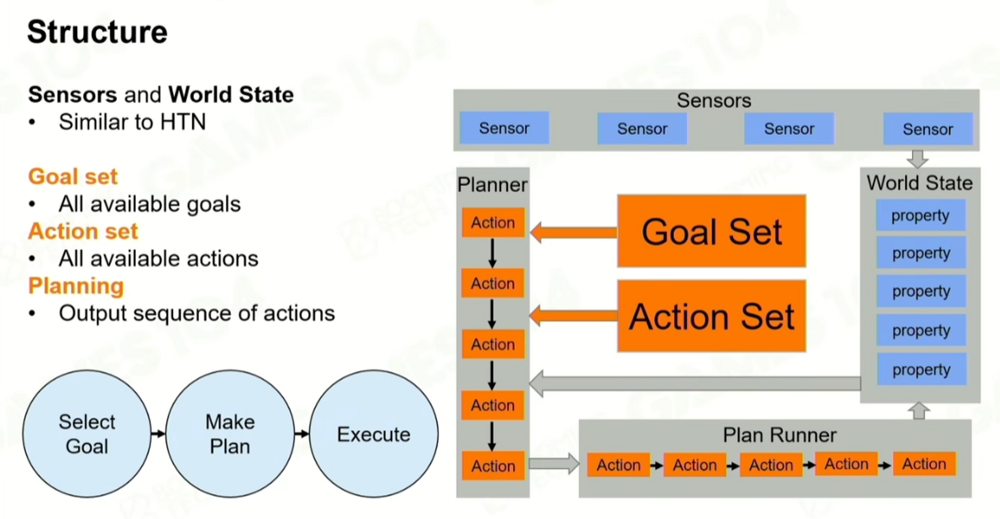
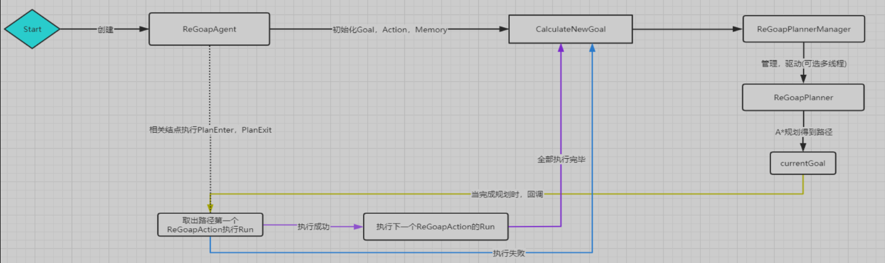

# GOAP

## 0 前言

最近在玩SIFU，其中的环境交互令人印象深刻，例如敌人AI会从地上捡起钢管来攻击玩家，或者踩墙飞踢玩家，或者用酒瓶投掷玩家。个人推测SIFU的敌人AI可能是用GOAP（Goal-Oriented Action Planning）来搭建的，因为AI和环境的交互具有明显的计划性，并且计划的步骤并不多。

在GDC2021里面，育碧参与了刺客信条奥德赛和渡神纪芬尼斯崛起项目的AI工程师，恰好就分享了项目是如何使用GOAP来搭建AI的。在分享中，演讲者梳理了GOAP是如何应用于刺客信条奥德赛的，以及在新项目渡神纪中GOAP又做了哪些针对性的迭代。整个分享呈现出了一个比较完整的开发脉络，对于了解育碧的工业化比较有帮助，甚至比GOAP本身更让人受到启发。

AC之前AI使用的状态机，开发到刺客信条枭雄这一代，游戏中有战斗（Fight）、搜索（Search）和调查（Investigation）三大状态机。设计师一旦想要添加或者修改某个行为，就必须处理这个行为对整个大的状态机带来的影响，这使得系统的维护变得困难了起来。

既然状态机本质上是一系列的行为和这些行为之间的过渡关系组成的，那么，完全可以将这些行为拆分出来，再通过一个胶水系统（Glue System）将不同的行为根据不同的条件以合理的顺序连接起来，从而取代复杂的状态机。而这个胶水系统，就是GOAP里的行为规划器（Planner）。

(https://zhuanlan.zhihu.com/p/465124301)
(https://zhuanlan.zhihu.com/p/138003795)

## 1 什么是GOAP（Goal-Oriented Action Planning

在游戏中设计敌人的AI一直是很大的一块需求，在需求的最开始，我们可能就是写了一堆的if分支，然后通过一系列方法各种读取环境的信息，根据环境的信息做反应，或者是是给AI一个相对固定、循环的模式。
后来大家注意到AI的行为大量耦合在一起不便于快速开发迭代，便诞生了状态机，分割了所有的状态，后来又对状态机通过transition的状态间相互耦合感到不满意，于是诞生了复用一系列transition条件的行为树，其实也可以称为树形状态机。
但是这些AI的特点都很明显，他们都是读取环境信息，然后根据信息找到分支然后找到执行的行为，属于 应激式AI。

在2003年，Jeff Orkin 发布的论文 Applying Goal-Oriented Action Planning to Games,他给我们阐述了一种基于目标的规划行为的 慎思型AI。

- 反应型AI（Reactive AI） ：先接受刺激输入，然后执行对应行为
- 慎思型AI（Deliberative AI）：将环境和背景条件纳入决策考量，可以胜任复杂决策
这个方案下的AI会制定自己的计划以满足他的目标，AI角色将会表现出较少重复的、可预测的行为，并且可以调整他的行为以适应他当前的情况。

这个方案的好处就是令状态机的状态们完全解耦，便于设计师在面临超大复杂度AI的设计中处理太多状态间的关系问题，也可以采用一些分模块、分等级的思路来更好的管理AI。
如果想要NPC对特定输入进行特定反应，那么可能GOAP并不适合，因为决策、规划需要时间。状态机和行为树在这点需求上比GOAP更合适，但是如果想要了各种互动和涌现式体验，那么GOAP是一个不错的选择。

## 2 细节

"An agent uses a planner to formulate a sequence of actions that will satisfy some goal."

解释一下GOAP中基础的概念：

- Goal：一个目标，一个世界状态数据，纯粹的数据，各个goal之间有优先级
- Action：一个改变世界状态数据的行为
    - Precondition：执行这个行为的条件，也是世界状态数据
    - Effect：执行成功后对世界状态数据的影响
- Plan：为了达到目标制定的一系列Action列表

同一时刻，只有一个目标启动，控制着玩家行为。
GOAP 中的Goal不包括Plan，也没有硬编码某个Goal的处理流程，他的Goal只是定义了数据，满足条件的过程是通过规划器实时决定的。Plan就是为了达到Goal State而规划出的Action list。
Action是一个独立的原子的Step，会让角色做某件事，去某个点、和xx交互、攻击。action有长有短，有的依赖于动画是否播完，每个action都有一定的条件和影响。
有时候我们对一扇门可以 轻轻推开、也可以用力把它砸开，我们应该有一个外部的机制决定对门行为的前置条件。
而一些Memory、Sensor，这些其实是规划器之外的都可以理解为给规划器的数据源。

因为goap把目标定义成了数学结构，是定量的表达的，然后就得到一个基于完成目标的规划问题，给所有的action都定义cost，Plan其实就是一个在图里找最短路径的问题。
原文中作者推荐了使用A* 的启发式搜索，goap中走的一个反向的规划，起点是Goal的世界状态，终点是当前状态，一定要规划到终点，以终为始的规划方法。

根据cost得到最小cost路径，但是实际上不一定是最短的方式，人定义的cost，cost最小也不一定是最快抵达的路径，cost通常会加上一些修改系数，给一些动态执行的action去有改变cost大小的能力。

## 3 难点与挑战

### 3.1 世界表达

我们需要的世界状态并不是简单指的游戏的地图环境，而是指所有可用于决策规划的信息，可以理解为智能体的所能感觉到的东西。

世界表示 比如使用一个世界属性的数组，世界属性包括 键值对，键可以是枚举，这个世界属性有时候还要标记出属于哪个object。

以这种状态表示的世界是一个超大的、不切实际的任务，我们其实只需要表示可以规划的最小的世界属性集合就行了，隔离杂乱的干扰属性是规划的关键，因为状态数量越多，每个状态加入有true或者false，n个属性总共的状态数量就是2^n的寻路的节点数量。

这样如果我们要支持一个高度复杂的AI的话要定义世界的信息就非常多，所有的数据都放在一层规划就会效率很低，并且很多数据不好量化，实现上也要注意性能。

### 3.2 具体类型表示

举个例子，在Regoap（一个Unity GOAP） 开源库里，他的state表达就是一个字典，里面就是string to object的一个pair。这个object里面可以放vector、bool、等任意类型。可以随时往字典里插入新的state。其实他就没有控制复杂度，并且这个值类型转object有装箱开销，并且他后面直接调用的Object.Equal来判断状态是否满足，其他子类型都重写了这个Equal方法并且使用了RTTI，效率较低。

育碧在这里其实把世界状态表述的和行为树的黑板一样，在编辑器下可以配置字符串到具体类型的表，规划器可以从黑板里读取数据然后进行规划，游戏中其他的组件单位和逻辑则可能改写黑板的数据。

### 3.3 字符串表示

在作者2004年的文章有提到关于世界状态的内容，他觉得可以使用类似术语的方式来定义行为，说白了就是使用字符串，然后用字符串进行比对，将规划中所有会出现的内容全部定义为字符串，而很多语言其实在处理字符串的时候有编译期优化，编译期确定的相同字符串的内容会指向同一个地址，这样比对速度会快很多。其实这种模式就有点像人类的符号学，用符号指代一个东西，通过符号来判断非常快速，目前来说我比较看好这种方案。

这种方案的一个问题在于，要想比较的快速，就要依赖编译期优化，意味着所有的字符串都不好定义在代码文件外部，其实可以通过外部文件生成代码的方式来解决，最后会得到string to string的一个pair。同时这种方案对于运行时的数据（比如一个随时变化的位置点）就不是很好处理，要动态生成字符串 ，这种方案其实适合放在顶层，value比较固定的情况，做复杂AI最上层的策略判断。

### 3.4 bool转化为枚举

这是Middle-earth™: Shadow of Mordor™的一个优化方法，他们注意到有大量的bool变量，通过合并一些bool变量成枚举的方式降低状态数量级，降低了节点数量就减少了A* 寻路的负担

## 4 规划器

### 4.1 Regoap流程

Agent就是负责控制AI逻辑的载体，Awake时候所有的Action、Goal、Memory组件都汇总到agent身上工作。
Start开始，CalculateNewGoal会从可行的Goal列表里选一个优先级最高的出来，如果在plannnig则不选择。
Plan开始，起点是Goal的满足，终点是 当前的entity状态。根据State数据创建A* 寻路使用的节点，第一个节点是NoAction的，我们将其加入优先队列，然后进入循环，直到优先队列为空、寻路算法迭代次数过多、达到了目标节点就停止循环。

### 4.2 Middle-earth™: Shadow of Mordor™的系统分层

Middle-earth™: Shadow of Mordor™也谈到了有关优化器的其他优化方法，因为数据量越大节点越多规划器的负担越重。
第一个做法就是分层，分层的目的是要尽量将Plan的路径变短。
他们将很多的逻辑从Planner系统中移除，Planner不会做每件事，他只会做高层的规划，剩下的交给其他底层系统来执行负担。

以调查为例，比如一个兽人，发现队友倒了，感到不对，然后开始调查的Plan，
我们希望一个小队的兽人是各有各的反应的，但是把这些东西全部加到planner里又会增加planner的复杂度，我们的做法是让兽人把观察到的信息上报到highlevelsystem，highlevelsystem，他会有一个角色系统,plan完之后会给小队里兽人分配角色，不同角色有不同的interest，也会有不同的反应。

可能有的角色不做规划而只是跟着那几个做了规划的角色行动，这也是一个优化点，缓存复用别人规划过的流程。

### 4.3 古墓丽影2013的Motive系统

一个经验：plan一个cost不高的action可能会因为各种runtime下情况而变得开销很高。

比如这里range attack 11比melee attack 21要cost低，拿着范围武器的时候才可以让AI执行范围攻击。

其实他可以把这些逻辑放进Goap规划的，但是为了减少节点数量可以将这些固定的逻辑抽出来，所以有时候也会使用这种在外部的条件来影响规划器。比如这里对range attack施加硬性攻击约束就是有必要的，这时候在外部可能就会写一些hard code的逻辑可能让他在某些case下更倾向于做什么。

他们做了一套motive系统，一言以蔽之就是他们想在外部有修改动态规划流程的能力，他们多做到了Action的数据根据情况改变而改变。

## 5 思考

我们需要解决很多问题，包括：

1、高效的世界表达

2、分层减少规划器的负担

3、行为模块化利于维护

4、更加自由的设计方法

5、完善的Debug工具

6、解决AI反应慢的问题

7、要给智能体足够多的选择，并且每个选择有各自不同的意义

GOAP因为需要规划，所以反应相对慢，可能通过一些LowLevelSystem可以解决部分问题。

我们可以通过替换planner的方式来实现不同风格的AI，可能AI不一定能规划到终点，规划器可能不一定使用反向规划法，使用正向规划也不错，从当前状态出发，就算没有规划到目标，AI也要可能也要先动起来，可能这样会更加有复杂的人的感觉，但是这样也可能带来一些永远完不成目标的情况，关于复杂 像人 好不好，还是看需求想要什么样的。

GOAP这个结构其实可以理解为一种思想，通过指定一些规划的规则 来生成一些包含许多变化的结果，但是这个变化又具备一定的可控制性。这个结构我与人讨论，设想中感觉用来做一些基于目的的故事生成感觉也可行，相当有意思的结构。