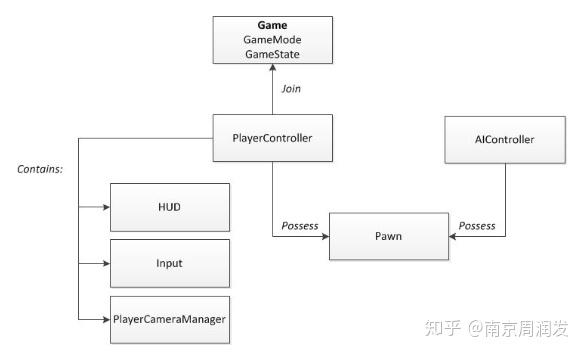
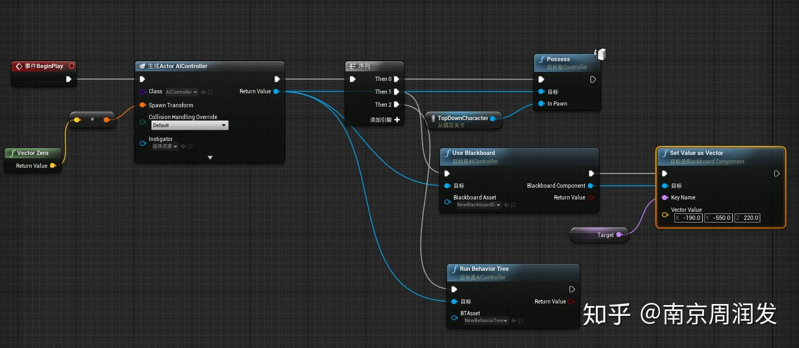

# AIController

## 0 简介

UE4中，玩家可以用PlayerController来控制Pawn，进行行走、跳跃、攻击等操作。但是像世界中的野怪等非玩家控制的角色，需要由AI来控制，UE4框架中，这一功能就由AIController组件完成。本文将介绍AIController的结构和一些功能实现方式，例如常用的控制pawn移动功能。

## 1 AIController

我们知道，Controller是UE4的Gameplay框架中非常重要的元素，如果说pawn是动作表现，Controller顾名思义，就是“大脑”。Controller主要有AIController和PlayerController两个子类，那AIController与PlayerController有什么区别呢？



PlayerController与AIController都会操控Pawn，是Pawn的“大脑”。不同点在于，AIController由AI驱动，不需要玩家介入，因此相比PlayerController，就不需要HUD、Input、PlayerCameraManager这些组件了。

AIController不与某个玩家相关，在DS模式下，AIController只存在于服务端，在服务端对Pawn做出操控后，再由Pawn把表现同步到客户端。

AIController虽然用于操控pawn，但并不代表所有AI逻辑都由它实现，AIController更像是一个桥梁，多种多样的AI逻辑通过AIController作用于pawn。这样分层后有一个好处，AI逻辑可以更加抽象和通用，不必关注底层实现细节。我们可以选择用代码实现AI，也可以用行为树组件通过节点拖拽来实现AI，都能达到相同的效果。


## 2 AIController使用行为树

UE4对行为树有良好的支持，可以在editor中创建行为树，自定义流程，通过节点拖拽实现AI功能。那么AIController要如何使用已经创建好的行为树呢？

### RunBehaviorTree

AIController通过RunBehaviorTree接口来执行行为树，该方法可供蓝图调用



AIController中有BrainComponent属性，类型为UBrainComponent，用于处理行为树的执行。

## 3 AIController的MoveTo实现

移动功能是AI操控中非常常用的功能，在抽象的AI层面，我们可能只需要发送一个“移动到某个坐标”指令，就能使角色移动过去。

该功能看似简单，不过底层实现却有很多细节要考虑：

路线如何计算，移动目标位置通常不是直线可达的
如何沿路线移动
移动速度如何设定
角色朝向如何设定
有一点需要注意，使用AIController的MoveTo功能，Pawn需要有继承自NavMovementComponent，常用的CharacterMovementComponent自然是可以的。

这里介绍的是MoveToLocation功能，AIController还有一个MoveToActor功能，可以随着Actor位置变化改变移动路线，最终到达Actor位置，其基本实现原理与MoveToLocation类似，只是Actor位置改变时会重新计算路径。

### 计算路线

移动的第一步就是计算路线，假如我们在1楼，目标点在3楼，我们该如何找到一条到达3楼的路线呢？当没有路线又该怎么办。

幸好，UE4已经整合了Recast作为默认寻路方案，可以自动为我们找到一条到目标点的最近路线。Recast通过预先处理场景地形数据，过滤可行走区域，处理角色体积碰撞，生成Navmesh，这样把场景抽象成可寻路的数据结构，在运行时就能快速计算路线了。

在编辑器中按下p键，可显示当前的Navmesh。

当我们请求一条通往目标点的路径后，Navmesh会返回给我们多个路点组成的路径，我们沿着这条路线移动即可。

Navmesh只是一种默认寻路实现，我们可以提供其他寻路实现，通过配置MovementComponent的NavMovement属性即可指定使用哪种寻路方式。

### 不用寻路功能

AIController的移动接口也提供了选项，不使用寻路功能，采用直线移动方式移动到目标点。比如飞行器在空中移动，此时无法使用Navmesh，但空中又没有其他地形阻挡，就可以选择直线路径。

### 沿路线移动

有了路线后，还需要使角色能够持续沿这条路线移动。这个功能由PathFollowingComponent实现，它是AIController中的一个属性，因此我们也可以通过实现自己的PathFollowingComponent自定义移动。

我们可以调用AIController::RequestMove来请求PathFollowingComponent执行一次移动，传入路径和请求参数，这个操作会直接终止当前正在执行的移动。

```cpp
/** Passes move request and path object to path following */
virtual FAIRequestID RequestMove(const FAIMoveRequest& MoveRequest, FNavPathSharedPtr Path);
```
然后PathFollowingComponent会返回一个FAIRequestID，代表这次移动的编号，每个移动都会有唯一的编号，用于回调函数的标记。

### PathFollowingComponent

主要属性：

UNavMovementComponent* MovementComp：关联的MovementComponent，也说明了移动的Pawn必须有MovementComponent。

CurrentRequestId：当前的RequestID，下个ID为自增1

Status：当前的状态

- Idle 没有Request
- Waiting 已经发送了move请求，在UpdateMove()执行后开始移动
- Paused 请求暂停，在ResumeMove()执行后重新开始移动
- Moving 正在沿着path移动

Path：当前移动的路线

MoveSegmentStartRef：当前Segment的开始端node引用

MoveSegmentEndRef：当前Segment的结束端node引用

PathFollowingComponent如何工作呢？

其实也不复杂，它会把我们的路径分成多个segment，每个segment都是直线移动，这样只要逐个完成简单的直线移动即可。这个工作当然少不了tick，PathFollowingComponent在执行TickComponent时会不断检查是否已经到达一个segment终点，如果到达就开启下个segment移动或通知到达终点，如果没到达就需要操控pawn沿着该segment继续移动。

### 设定移动速度

当沿着segment移动时，角色的速度显然需要沿着segment方向，但速度大小要如何设置？是直接设为最大值，还是有加速过程？

PathFollowingComponent提供了两种方式来设置速度，一种为直接把沿segment的速度设置到角色上，直接改变速度，另一种为把加速度应用到角色上，间接改变速度。

直接应用速度: 

速度大小与segment终点和当前位置的长度成正比，但如果不是最后一段segment移动，会直接使用character的最大速度。在segment切换时，速度方向也是瞬间变化的。

打开movement调试，可以清晰看到当前速度。

应用加速度：

加速度大小与segment终点和当前位置的长度成正比，移动快到终点时也会根据需要减速。这个加速度会用于计算pawn这个tick移动的速度。这样更加自然，会有加速减速的过程。

### 设定角色朝向

移动过程中角色朝向也需要注意，当切换segment时，可以让朝向与ControlRotation一致，也可以让朝向与速度/加速度方向一致，但不管ControlRotation、速度、加速度，它们大部分时间都是与segment方向一致的。

#### 与ControlRotation一致

可以通过设置UseControllerRotation实现，比如常用的是Yaw，这么做会让角色朝向**瞬间切换**。

这里有个问题，AIController不接受玩家输入，它的ControlRotation是什么呢？

可以看AAIController::UpdateControlRotation方法，它把FocalPoint，即当前移动目标与自身的朝向作为ControlRotation，然后立即更新Pawn的Rotation。

#### 与速度/加速度方向一致

如果不想旋转立即与ControlRotation一致，而想让旋转自然的缓慢改变，有一个转向过程，可以选择使用以下两个配置之一，bUseControllerDesiredRotation和bOrientRotationToMovement，前提是把上文的bUseControllerYaw/Pitch/Roll等都关闭。前者为使用速度方向作为目标使用着两个配置后，Pawn的rotation会以可配置的RotationRate作为旋转速度，进行自然的转向。RotationRate可以分别配置Yaw/Pitch/Roll上的改变速度，如果某一维度为0，则不会改变。

具体如何使用加速度/移动方向来渐渐改变Rotation，可见UCharacterMovementComponent::PhysicsRotation函数。该函数在UCharacterMovementComponent::PerformMovement中执行，要求Character有Controller，或者开启了bRunPhysicsWithNoController。