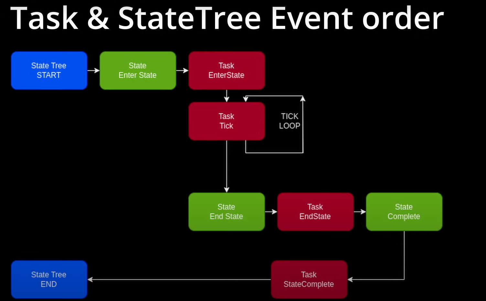

# State Tree分析

官方文档（5.5）

https://dev.epicgames.com/community/learning/tutorials/lwnR/unreal-engine-your-first-60-minutes-with-statetree

https://dev.epicgames.com/documentation/en-us/unreal-engine/state-tree-in-unreal-engine

## 1 简介

StateTree 是一种通用分层状态机，组合了行为树中的 选择器（Selectors） 与状态机中的状态（States） 和 过渡（Transitions） 。用户可以创建非常高效、保持灵活且井然有序的逻辑。

StateTree包含以树结构布局的状态。状态选择可以在树中的任意位置触发，但它最初从根开始。在选择过程中，将对每个状态的 进入条件（Enter Conditions） 求值。如果通过，选择将前进到该状态的子状态（如果可用）。如果没有子状态可用，将激活当前状态。

### 1.1 与Behaviour Tree区别

State Tree focuses on "State" while Behaviour Tree focuses on Task.

状态树分层（树）结构，行为树树状结构。 

行为树与状态机之间的一大区别是，状态机通常在执行沿树向下推进时提交状态选择，而行为树则尝试查找合适的叶节点。一般来说，即使已经选择一个状态，行为树也会继续执行状态选择逻辑。这是在状态之间过渡的唯一方法。StateTree基于过渡按需运行状态选择过程。在第一个Tick上，会隐式过渡到根状态，这将选择要运行的第一个状态。选择该状态之后，过渡会指示何时及在何处执行选择逻辑。

---

状态树使用上更自由，功能更多。

---

Behaviour Trees invented after State Machines, to make developers life easy by getting rid of the complexity of transitions and unreadable sphagetti graphs.

行为树主要的优势是，单个行为可以很容易地在另一个更高级别行为的上下文中重用，而无需指定它们与后续行为的关系。所以在视觉上很直观，易于设计、测试和调试，并且比其他行为创建方法提供了更多的模块化、可伸缩性和可重用性。

Refs:

https://dev.epicgames.com/community/learning/tutorials/L9vK/unreal-engine-common-issues-with-behavior-trees-and-things-you-should-competely-avoid

https://www.youtube.com/watch?v=5ZXfDFb4dzc&ab_channel=BobbyAnguelov

https://www.thegames.dev/?p=70

### 1.2 Terminology

https://dev.epicgames.com/documentation/zh-cn/unreal-engine/overview-of-state-tree-in-unreal-engine

## 2 Task & State Tree Event Order

## 3 教程

Laojiang
https://www.bilibili.com/video/BV141421i7v6/?spm_id_from=333.999.0.0&vd_source=784cac4665672e741fbe89004f7e0c75

SO
https://www.youtube.com/watch?v=ZmCYH5ySNtU&ab_channel=UnrealDevOP

Hide and Flee
https://www.youtube.com/watch?v=5XP4CRtQFO4&ab_channel=ThreeWays

Companion
https://www.youtube.com/watch?v=4AI1Zd4s4FY&ab_channel=D3kryption